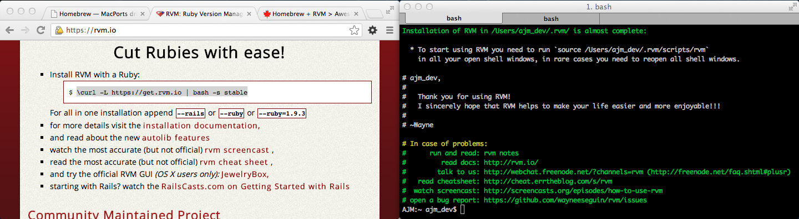

#WDI Installfest 


We are going to install the tools necessarily to program with Ruby and Rails on your computer.

If you are unsure or run into problems during installation, don't worry; We will finish up any of the loose ends on Installfest.
	

##Verify your install
If you have already experimented with ruby or rails before, verify your versions are correct for this upcoming class.

If you can see the correct version numbers when you run the commands in Terminal below, you are good to go.

**Verify you are running 2.0+ of ruby**

`ruby -v`

**Verify you are running version 4 of Rails**

`rails -v`

If not, continue with the instructions to get your environment going. Run these again after you're done to ensure everything is working properly.

====


#Mac Instructions
* Install Xcode or Command Line Tools
* Install Homebrew (Software Package Manager for Mac)
* Install GIT
* Install RVM and Rails
	

##Install Command Line Tools (Maverick)
Before this class, we suggest you upgrade your OS to Maverick. If you are running Maverick, you don't have to install Xcode in order to get command line tools.

In your terminal type `xcode-select --install` and a new window and installer will appear. 


##Xcode (Non Maverick Machines)
If you are not running Maverik, you will need to install Command Line tools that come from Xcode.


*	Create an account on Mac App Store if you haven't already.
*	Upgrade your OS to the latest version possible using the Mac App Store.
*	Open the Mac App Store and install Xcode
*	Open Xcode, Choose Preferences, Downloads and then Install The Command Line Tools


##Install Homebrew

###Homebrew
[http://brew.sh/](http://brew.sh/)

Open up the application Terminal and run the command below to install Homebrew

```
ruby -e "$(curl -fsSL https://raw.github.com/mxcl/homebrew/go)"
```


###Brew Doctor
Run `brew doctor` in your Terminal to let you know if the install was successful. It will give you tips on what you can do to correct any system wide issues. If you do have any problems, resolve them. If you have any questions or unsure, we will take care of these issues during Installfest.


You may need to edit your ~/.bashrc to have include the path to homebrew, if `brew doctor` returns any warnings.

```
bash echo 'export PATH="/usr/local/bin:/usr/local/sbin:~/bin:$PATH"' >> ~/.bash_profile
```


##GIT

Sign up for an account on [http://www.github.com](http://www.github.com). We will be using github.com for for keeping track of code.


###Install git
```
brew install git
```


###Update git config information
Eventually you'll want to configure your github settings to use your account.

```
git config --global user.name "YOUR-USERNAME"
git config --global user.email YOUR-EMAIL-ADDRESS
git config --global credential.helper cache
```

###Generate a SSH key for github
Following the below instructions will allow you to use github on your machine without having to input your login credentials.

* [Generating SSH Keys (via Github.com)](https://help.github.com/articles/generating-ssh-keys)


##RVM and Ruby
RVM is a Ruby Version Manager. It lets you easily switch between ruby versions.

###Install RVM with Ruby

[http://www.rvm.io](http://www.rvm.io) for full instructions


Running the following command will install the latest version of Ruby as well as the RVM envionment into your session.

```
\curl -L https://get.rvm.io | bash -s stable --ruby
```




##Rails

###Install Rails 4
After you have installed ruby, we will install a version of rails 3 for the class.

```
gem install rails
```
If this causes issues on your machine, try running `sudo gem install rails` instead


##Sublime text editor

Got to: [Sublime website](http://www.sublimetext.com/) and follow install instructions.

===

#Ubuntu Instructions 


##apt-get

###Install apt-get
```
sudo apt-get install curl
```

##rvm & ruby

###Install RVM
```
\curl -L https://get.rvm.io | bash -s stable --ruby
```


##rails

###Install Rails 4
```
gem install rails
```


##git

###Install git
```
sudo apt-get install git-core
```

###Update git config information

```
git config --global user.name "YOUR-USERNAME"
git config --global user.email YOUR-EMAIL-ADDRESS
git config --global credential.helper cache
```

##Sublime text editor

Got to: [Sublime website](http://www.sublimetext.com/) and follow install instructions.

===

#Windows Users

Note: Using Windows is not recommened for this class.

**Ruby Installer:**

The install on Windows is actually very with the bundle from [rubyinstaller.org](http://www.rubyinstaller.org)

Just be sure to grab the 2.0.0 version, as that will be the version we will be using in class. This will set up your environment and you can start running ruby files right away. 

To install rails, run the following command `gem install ruby`


**Extra command line tools: **

We will be using the command line a lot here. On Windows I also like to install gow. Gow is a bunch of unix command line tools ported to Windows. It will make it easy to follow in class with the same commands as your Mac buddies. 

[https://github.com/bmatzelle/gow/wiki](https://github.com/bmatzelle/gow/wiki)
